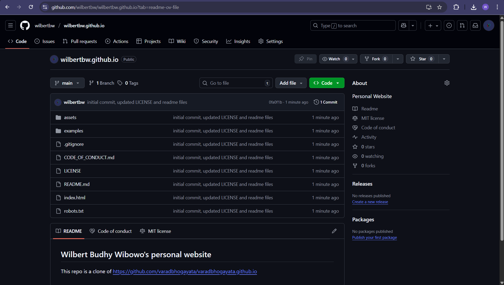
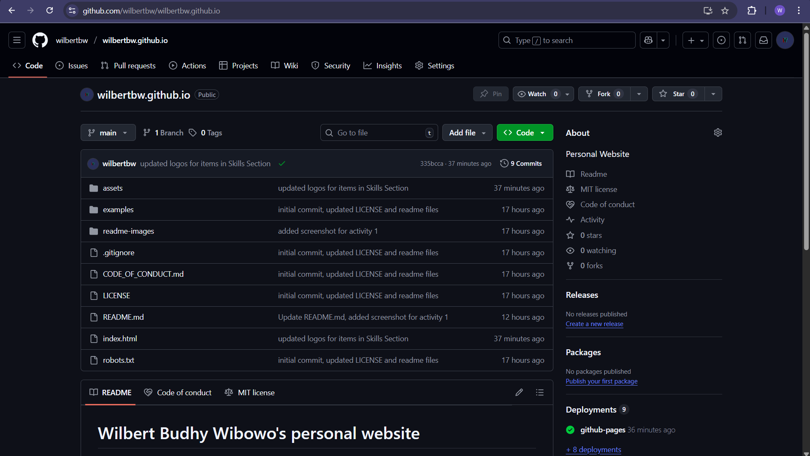
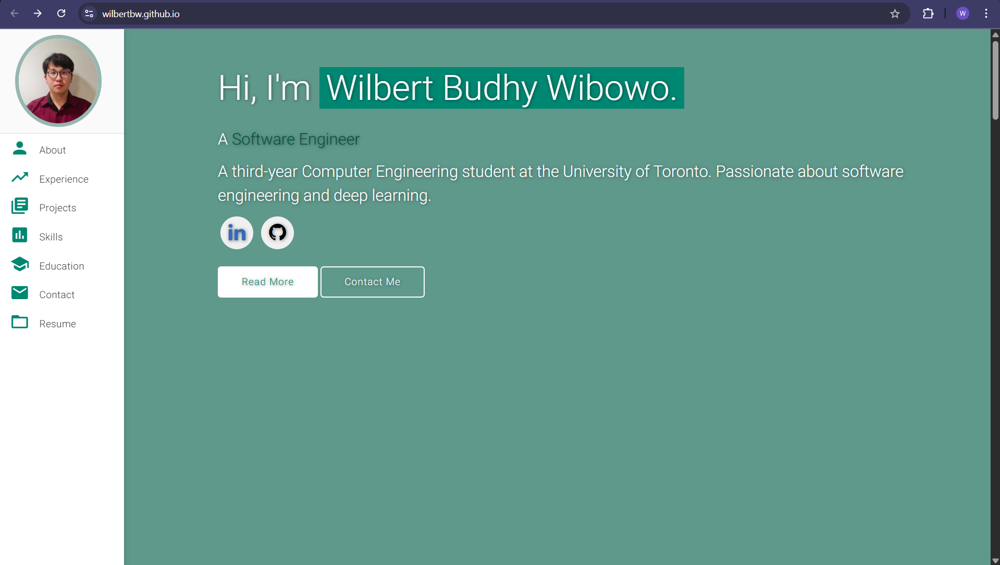
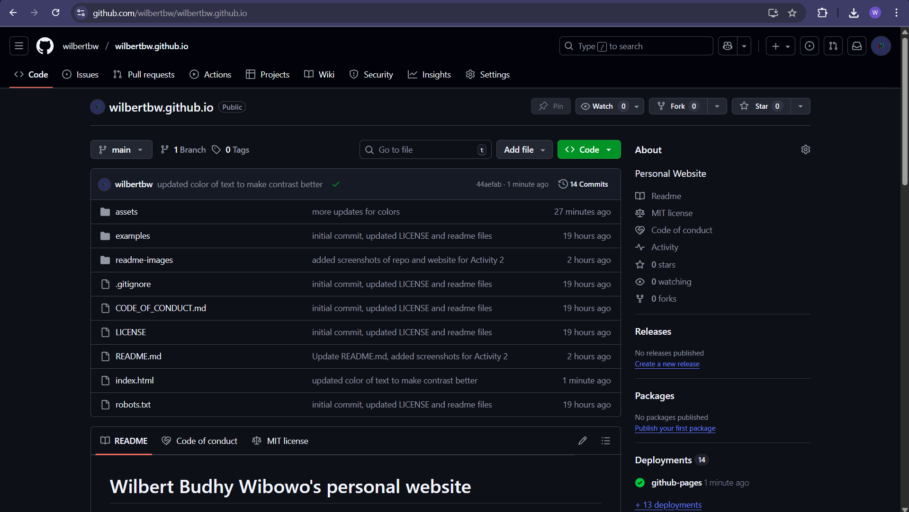
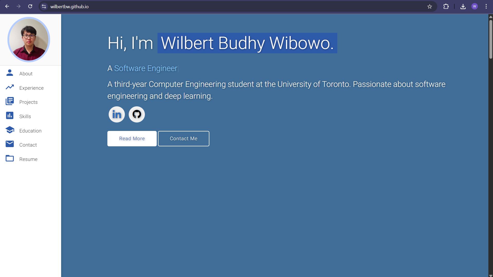
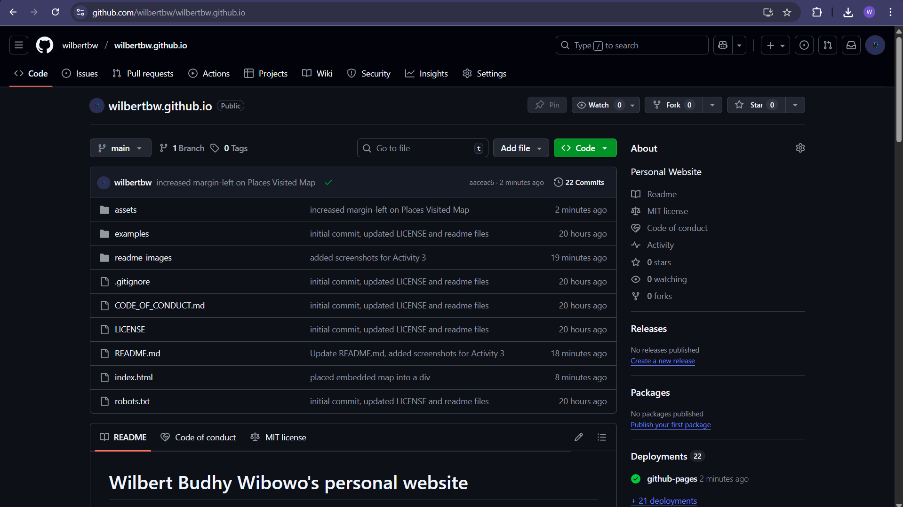
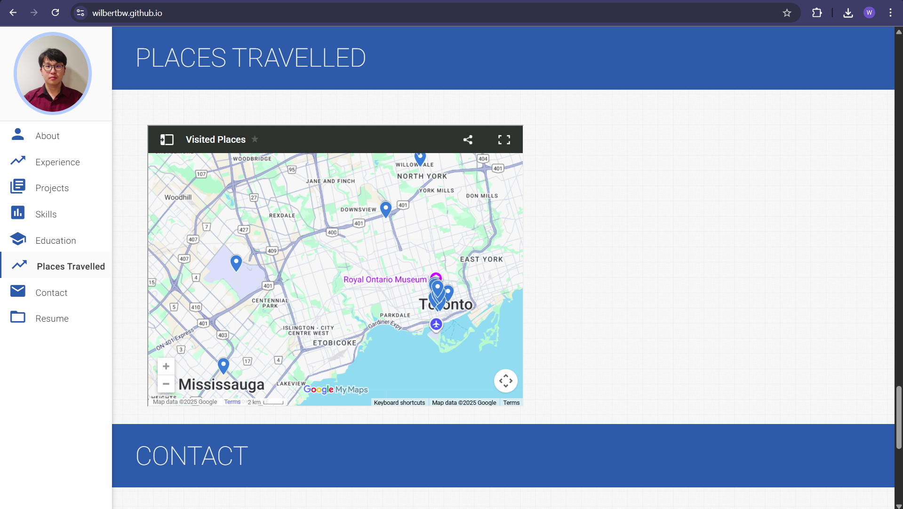
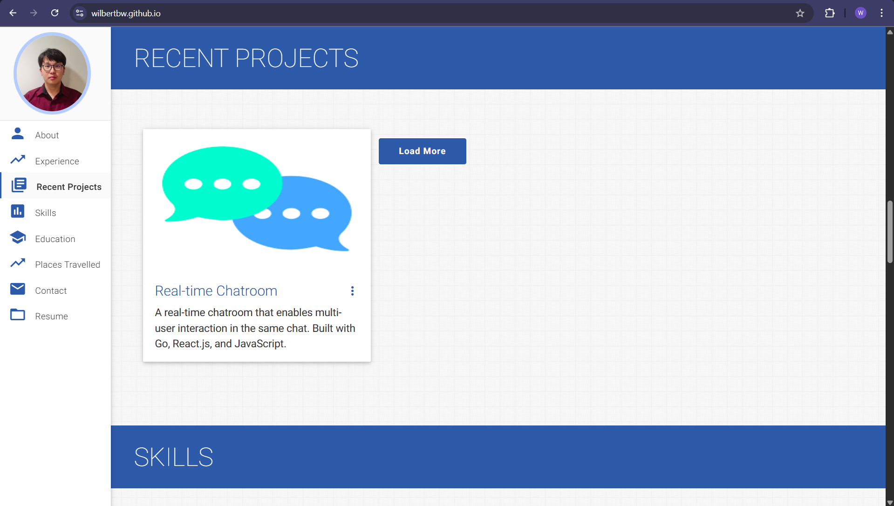
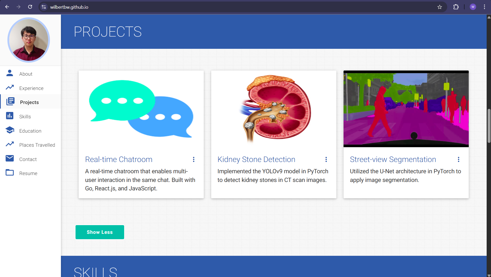

# Wilbert Budhy Wibowo's personal website

This repo is a clone of [https://github.com/varadbhogayata/varadbhogayata.github.io](https://github.com/varadbhogayata/varadbhogayata.github.io)

## Activity 1

## Activity 2

## Activity 3

## Activity 4

## Activity 5

